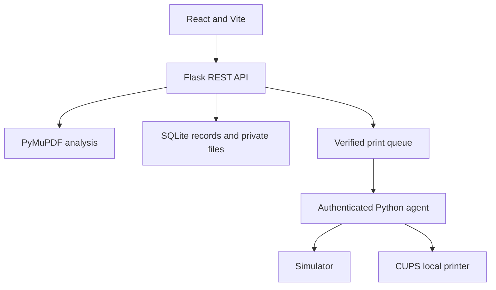

# AutoPrint AI

A complete SIH prototype for intelligent self-service printing, based on the supplied dashboard reference and project prompt. The root opens the working dashboard; `/home` opens the public-facing product introduction.

## What works

- PDF upload (10 MB, 150 pages), page count, conservative blank-page and color detection, private document preview.
- Six-step workflow: upload, analyze, configure, review, test payment, tracking.
- Copies, A4/A3, B&W/color/auto, duplex, page ranges, 1/2/4 pages per side, orientation, and optional blank-page removal.
- Server-calculated prices, configurable admin rates, saved orders, failed-payment simulation and retry.
- Persistent private workspace, paid-only queue, pause/resume/cancel/reassign, printer management, profile preferences, CSV export.
- Live simulated queue progression and database-derived analytics. Sample records are labeled and filterable.
- A separate authenticated Python print agent, CUPS integration, a persistent submission journal, and simulation mode.

## Run the requested React + Flask version (Windows)

Install Python 3.11+ and Node.js 22.13+ (24 LTS is suitable). Extract the archive and open two terminals in the project folder. Copy `.env.example` to `.env` if you want to override defaults. No external service, payment gateway, Raspberry Pi, or printer is required.

Terminal 1:

```powershell
cd backend
python -m venv .venv
.venv\Scripts\python -m pip install -r requirements.txt
.venv\Scripts\python app.py
```

Terminal 2:

```powershell
cd frontend
npm install
npm run dev
```

Open the URL printed by Vite (normally http://localhost:4173). Vite proxies `/api` to Flask at http://127.0.0.1:5000, so cookies and uploads use the same origin. Keep both terminals running. On macOS/Linux, use `.venv/bin/python` instead of `.venv\Scripts\python`.

**Important:** Start Vite inside `frontend/` for the Flask version. The root developer command uses the hosted API adapter described below.

SQLite, private uploaded PDFs, and the generated local session secret are stored in `backend/data/`, which is excluded from source control. Keep this directory if you want to preserve your local workspace. The anonymous session cookie identifies your workspace; clearing browser cookies creates a separate workspace. The demo is intentionally a single-workspace prototype, with a freely accessible demo admin view.

## SIH demonstration (about 2 minutes)

1. Open New Print and choose **Use sample PDF**.
2. Analysis reports six pages, likely blank page 3, and likely color pages 2 and 5.
3. Apply recommendations, then inspect the original document preview.
4. Choose B&W, double-sided, one copy, and remove the blank page. The default A4 quote is ₹4 for five pages on three sheets. Two paired duplex sheets cost ₹3; the remaining side costs ₹1.
5. Review the order and verify a test payment. You can demonstrate a failed payment and safely retry first.
6. Watch the job progress through the queue, controller, printing, and completion (about 30 seconds when the printer is available).
7. Open Usage & Analytics and choose **Your uploads only** to see the new job’s paper usage and savings separately from sample data.
8. Use Admin workspace to update pricing or manage printers.

## Hosted website and root developer mode

The hosted environment runs Cloudflare Workers rather than Python. It uses the same React UI and REST contract, a Worker API in `worker/`, D1 for durable records, and private R2 document storage. The uploaded PDF is rendered and analyzed in the browser with PDF.js; the server validates PDF structure, page count, file size, ownership, print settings, prices, and test-payment state. Browser analysis is appropriate for this test-only simulator and must not become the authority for real billing without a trusted server analysis service.

The local Flask application uses **PyMuPDF on the server**, independently of the browser. Both implementations have regression tests for pricing, payment gates, record ownership, and queue behavior. No advanced ML, OCR, forecasting, live payment integration, or physical hardware testing is claimed.

For the hosted API adapter locally:

```sh
npm install
npm run dev
```

This runs the hosted API unchanged using Node’s SQLite module and private files in `.sites-runtime/`. For a production build:

```sh
npm run build
```

Output is `dist/client/` (Vite assets), `dist/server/index.js` (Worker), and `dist/.openai/` (logical hosting bindings and migrations). The frontend code is shared by both deployments; there is no static fake-data version.

## Architecture



```
frontend/src/
  components/       Layout, reusable UI, charts, modal
  pages/            Dashboard, new print, jobs, management, landing
  hooks/            Workspace polling and shared state
  services/         API client and browser PDF analysis
backend/
  app.py            Flask routes, session ownership, request validation
  config.py         Environment and private local data paths
  services/         PDF, pricing, queue, payment, analytics, insights, storage
  test_workflow.py  API integration test using an isolated temporary database
print_agent/
  agent.py          Authenticated polling and persistent submission journal
  printer_service.py
  cups_service.py   Actual CUPS integration (loaded only for real mode)
  config.py
worker/             Hosted API and shared domain logic
scripts/            Build, local hosted adapter, hosted regression test
 db/schema.ts       D1 schema; generated migrations live in drizzle/
```

## Pricing rules

All prices come from one stored rate record per workspace and are recalculated on the server when an order is created. Existing order quotes do not change when admin rates change.

| Default rate          |   INR |
| --------------------- | ----: |
| A4 B&W single side    |  1.00 |
| A4 B&W duplex sheet   |  1.50 |
| A4 color printed side |  5.00 |
| A3 B&W single side    |  3.00 |
| A3 B&W duplex sheet   |  4.50 |
| A3 color printed side | 10.00 |

Page ranges are validated, sorted, and deduplicated. Blank-page removal happens before imposition. Multiple pages per side are grouped before pricing; an imposed side containing color is treated as color in Auto mode. Each pair of B&W sides uses the duplex sheet rate. An unpaired B&W side uses the single-side rate. Copies multiply the result. Sheets saved compares this configuration with one selected original page per sheet, for the same number of copies.

## Raspberry Pi agent

For the standalone agent simulator:

1. Run the Flask version, create a workspace, and copy the workspace ID from Admin > System Settings.
2. In `.env`, set a long random `PRINT_AGENT_TOKEN` (generate locally with `python -c "import secrets; print(secrets.token_hex(32))"`), `PRINT_WORKSPACE` to that workspace, and the relevant `PRINT_AGENT_PRINTER_ID` (e.g. `pi-01`). Keep tokens out of Git.
3. Set `PRINT_MODE=agent` to disable the API’s internal simulator, `AGENT_MODE=simulation`, and `ALLOW_TEST_PRINTING=true` to explicitly authorize the simulator to process test-paid jobs.
4. Restart Flask. Run `python print_agent/agent.py` in a third terminal with the same dependencies installed.

For a controlled physical-printer prototype, configure a local CUPS printer on the Pi, install pycups in the agent environment, set `AGENT_MODE=real`, and set `CUPS_PRINTER_NAME` to the exact local queue name. CUPS must remain on the private network. The agent makes outbound authenticated requests; no printer port is exposed publicly. `ALLOW_TEST_PRINTING=true` is an explicit opt-in to print controlled test jobs physically. Leave it false for normal operation.

The agent downloads only backend-selected pages, honors CUPS copies/media/sides/imposition/color/orientation options, and checks CUPS job-state before reporting completion. Its local journal prevents automatic duplicate physical submissions after restart. Ambiguous submissions stop for operator reconciliation. Hardware failures and specific driver support have **not** been tested against a physical printer. The hosted website intentionally does not authorize a real agent; use the Flask service for hardware work.

## Payment integration boundary

The current payment service is **test only**, with no real money movement and no payment secrets in the frontend. UPI, QR code, and card are selectable mock methods; no real QR or card form is shown. Test payment verification happens on the server and only verified jobs enter the queue. Setting `DEMO_MODE=false` disables mock verification. Live Razorpay support requires a server-side gateway order, signed callback/webhook verification against the stored amount and currency, event replay protection, and verified settlement state before enabling real billing. The integration point is `backend/services/payment_service.py`; `.env.example` contains the future gateway variables. No unfinished gateway is represented as live.

## Storage and security

- UUID document IDs and workspace ownership checks; private bytes are returned only through the owned-document API.
- HTTP-only same-site session cookies, origin checks on mutations, file signature/size/page-count validation, prepared SQL, and request-rate limiting.
- The local demo is bound to loopback by default. Run behind a proper WSGI service and HTTPS when deploying Flask elsewhere.
- Local non-demo admin writes require `X-Admin-Token`. A real shared institution deployment still requires user authentication, staff roles, retention/deletion policy, hardened PDF processing, and a trusted payment provider. The hosted private demo is not a multi-tenant production billing system.
- Database tables store workspace-scoped JSON records to keep the prototype repositories small. `users`, `documents`, `print_jobs`, `payments`, `printers`, `printer_status`, and `pricing` are actively persisted. Analytics/resources/insights are computed from jobs; their reserved tables support future materialized summaries. A production PostgreSQL migration should normalize queried job fields and add indexes based on actual reporting queries.
- The simulator advances persisted jobs when an API request runs; the UI polls every four seconds. It is a deterministic demo, not an always-running hardware daemon. Only one active job per printer is advanced at a time.

## Verification

```sh
python backend/test_workflow.py
node scripts/test-hosted.mjs
npm run build
```

Tests use isolated temporary data. They cover real PDF page/color/blank analysis on Flask; hosted PDF structural validation; invalid page ranges/files; private document ownership; server-authoritative quotes; payment failure/retry/idempotency; authorized queue progression; and derived analytics. The browser workflow was checked from sample upload through analysis, a ₹4.00 B&W quote, failed test payment, successful retry, and completed simulated printing. The 390-pixel mobile viewport and navigation drawer were checked with no horizontal overflow. WebMCP navigation/read tools are feature-detected; execution validation requires a browser with `document.modelContext` support, which was unavailable in the test browser.
